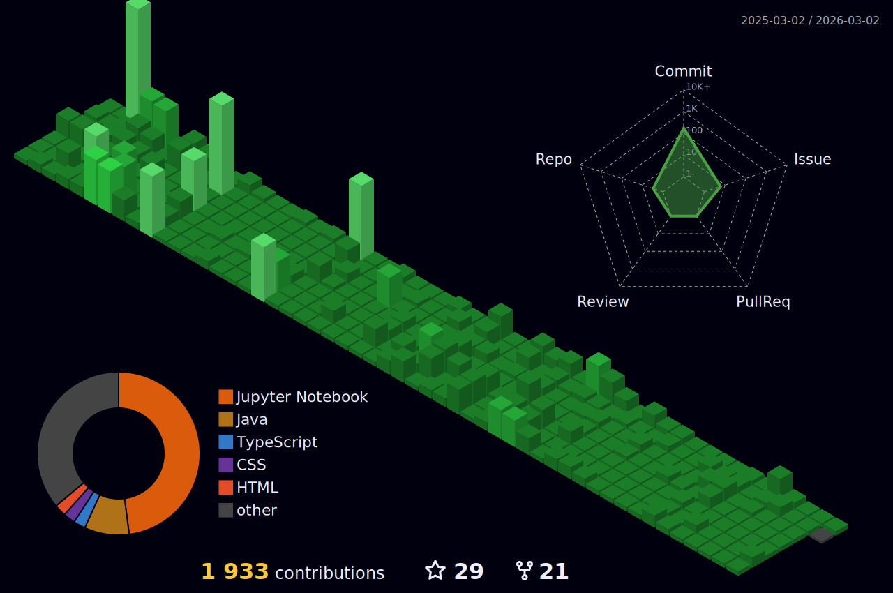

### <p align="center">Hey  I'm Vikash PR</p>

<p align="center"> 
  <a href="https://github.com/vikashPR"></a>

</p>
 <p align="center">
  <a href="#"> <a/>
  <a href="#"><a/>
  <a href="#"><a/>
  <a href="#"><a/>
</p>
	  


☞ 〔 ⚪️ 〕🎀 Pink is Sweet 🎀 | 🌹 Rose is red

☞ 〔 🐵 〕 <a href="https://www.webilicious.in/"></a> <a href="https://www.srmist.edu.in"></a>

☞ 〔 🐼 〕Frot End DEV

☞ 〔 🤾 〕18

☞ 〔  〕Vue Simp

☞ 〔 👀 〕

<br>

### aboutMe.Js:

```javascript
const VikashPR = {
   pronouns: "he" | "him",
   code: [HTML,JS,CSS,C/C++],
   askMeAbout: ["Web Development","C/C++","Discord","IOT"],
   technologies: {
       frontEnd: {
           Js: ["VueJs", "Vuetify"]
       },
       backEnd: {
           BasS: ["firebase"]
       },
       competitive: {
          compilerLang: ["C/C++"]
   }
};
```

### Programing Languages:


<!--  GIf -->

<a href="#"></a>

### Front End:


<!--  -->

### Front End FrameWork:


### Backend End:


### Utility:


### Persnol Setup:


### Tools:


	 

### Social Media:
 <p align="center">
  <a href="https://www.instagram.com/viki_sam_/"><a/>
  <a href="https://www.linkedin.com/in/vikash-pr-086b21193/"><a/>
  <a href="https://github.com/vikashpr"><a/>
  <a href="https://twitter.com/Vikash11430482"><a/>
  <a href="https://github.com/vikashpr"><a/>
  <a href="https://stackoverflow.com/users/14201913/vikashpr"><a/>
  <a href="mailto:vikashrajendran2806@gmail.com?subject=Github profile Visit"><a/>
</p>

### VikashPR.com speed:

  | 

### Github Stats:

 |  
:-------------------------:|:-------------------------:
 |  


### Github contribution:
	  
<h4 align="center">My contribution graph</h4>

<p align="center">  </p>

<h4 align="center">Watch my contribution graph get eaten by the snake 🐍</h4>

<p align="center">  </p>
    
<h4 align="center">Isometric view of contributions in the last year.</h4>
	  
<p align="center">
	<a href="./profile-3d-contrib/profile-night-green.svg">
		
	</a>
</p>
