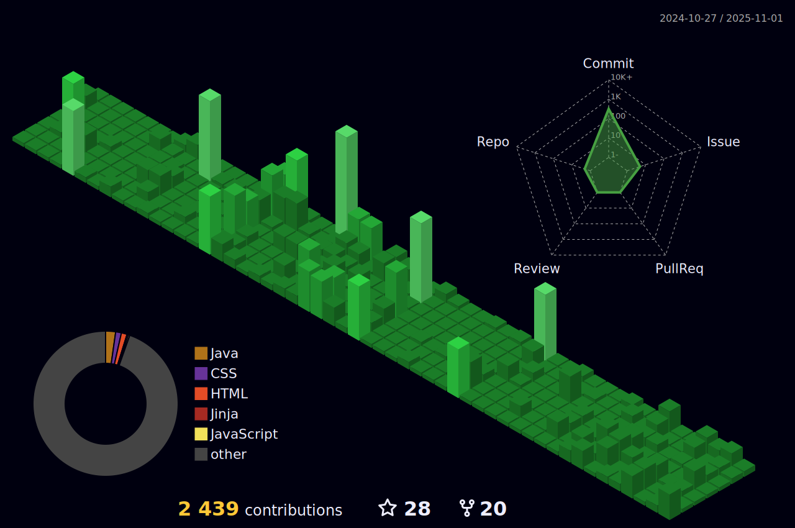

### <p align="center">Hey  I'm Vikash PR</p>

<!-- <p align="center">

</p> -->


<p align="center"> 
I love turning that GitHub contribution graph ⬇️ more green 🟩 in my <del>spare time</del> full time 🙃
</p> 

<br/>

 <p align="center">
  <a href="#"> <a/>
  <a href="#"><a/>
  <a href="#"><a/>
  <a href="#"><a/>
</p>
	  


☞ 〔 ⚪️ 〕🎀 Pink is Sweet 🎀 | 🌹 Rose is red

☠〔 🵠〕 <!-- <a href="https://www.webilicious.in/"></a> --> <a href="https://www.sc.com/en/"></a>

☞ 〔 🤾 〕22

☞ 〔 :octocat: 〕Github Simp

☠〔 👀 〕

☞ 〔 🐼 〕SD - DevOps - AI

<br>

### aboutMe.Js:

```javascript
const VikashPR = {
   pronouns: "he" | "him",
   code: ["JS", "PYTHON"],
   askMeAbout: ["Software Engineering", "DevOps", "Reserch"],
   technologies: {
       frontEnd: {
           js: ["Vue.js", "React.js", "Next.js", "Springboot"]
       },
       backEnd: {
           basS: ["Firebase"]
       },
       competitive: {
           compilerLang: ["C/C++"],
           interpretedLang: ["PYTHON"]
       }
   }
};
```

 

 


### Github contributions:

<!-- <h4 align="center">My contribution graph</h4>
<p align="center">  </p> 
-->

<h4 align="center">Watch my contribution graph get eaten by the snake 🐍</h4>

<p align="center">  </p> 
<h4 align="center">Isometric view of contributions in the last year.</h4>
	  
<p align="center">
	<a href="./profile-3d-contrib/profile-night-green.svg">
		
	</a>
</p>
<br/>
<p align="center">  </p>

